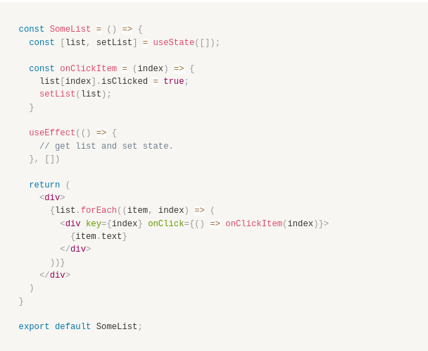
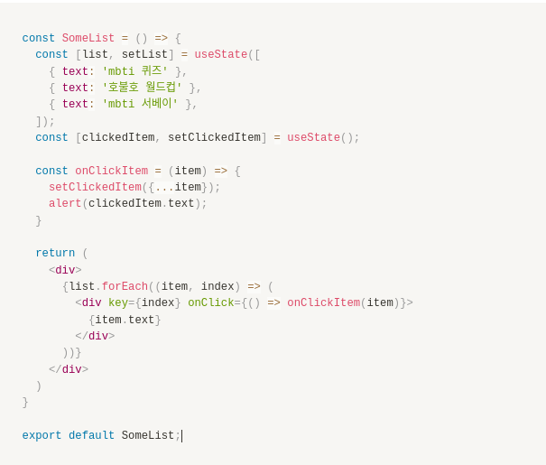

# README

## 문제 1

아래 코드의 문제점과 그 이유를 서술해주세요.

- list 상태값을 직접 사용하고 있다.
- 컴포넌트는 setState로 변화된 경우에 render함수를 호출한다.
- state를 직접 변경하면 렌더링이 일어나지 않을 수 있다.

## 문제 2

`alert(clickedItem)`의 실행 결과와 이유를 서술해주세요.

- 처음 클릭한 경우 오류가 발생하고 그 이후 부터는 직전에 클릭한 item을 출력한다.
- useState와 alert 모두 비동기 함수로 callstack에서 바로 실행되는 것이 아니라 web API가 처리 한다.
- 이 때 alert에 clickeditem은 setClickedItem이 상태를 변경하기 이전 값이 입력된다.

